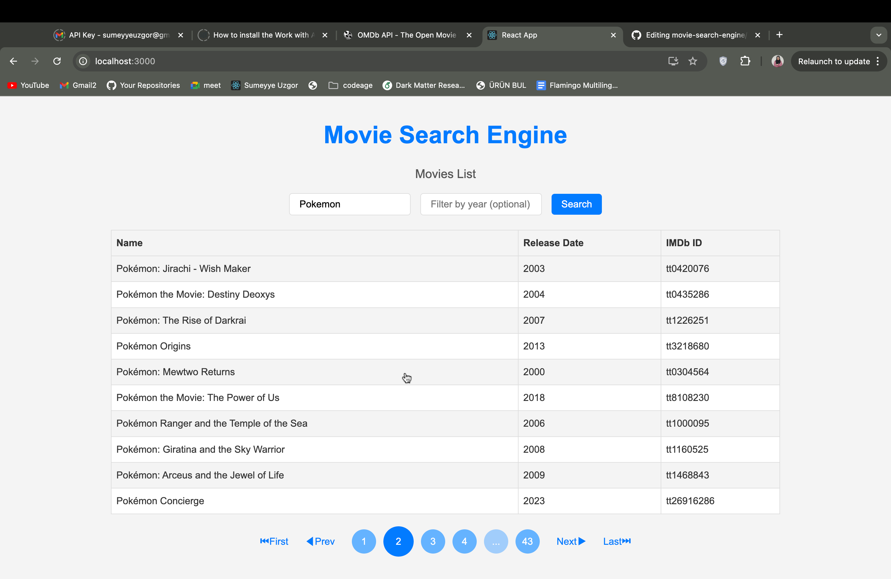

# Movie Search Engine

A single-page application (SPA) for searching and viewing detailed information about movies. Built with React and Redux, it fetches data from the [OMDb API](http://www.omdbapi.com/) and provides a seamless user experience with pagination, filtering, and detailed movie views.

## Getting Started

Follow these steps to download, install, and run the project on your local machine.

### Prerequisites

Make sure you have the following installed:

- [Node.js](https://nodejs.org/) (v16+ is recommended)
- [npm](https://www.npmjs.com/) or [yarn](https://yarnpkg.com/)

### Installation

1. Clone this repository:

```bash
git clone https://github.com/your-username/movie-search-engine.git
```

2. Navigate to the project directory:

```bash
cd movie-search-engine
```

3. Install dependencies:

```bash
npm install
# or
yarn install
```

### Starting the Development Server

1. Start the app:

```bash
npm start
# or
yarn start
```

2. Open [http://localhost:3000](http://localhost:3000) in your browser to view the app.

## Features

- Search Movies: Search for movies by name using the [OMDb API](http://www.omdbapi.com/).
- Filter by Year: Narrow down results by specifying a release year.
- Pagination: Displays movies in a paginated table for easy navigation.
- Movie Details Page: Click on a movie to view detailed information, including its poster, genre, director, cast, and plot.
- Error Handling: Handles cases like invalid searches or missing movie details gracefully with custom error pages.
- Responsive Design: Optimized for various screen sizes.

## Libraries and Tools Used

| Library/Tool      | Purpose                                                            |
| ----------------- | ------------------------------------------------------------------ |
| **React**         | Framework for building the user interface.                         |
| **Redux Toolkit** | Manages the global state of the app.                               |
| **React Router**  | Handles routing between the main pages and the details page.       |
| **Sass (SCSS)**   | Provides styles and theming for the app with variables and mixins. |
| **Yup**           | Validates form input (search terms and filters).                   |
| **axios**         | Makes HTTP requests to the [OMDb API](http://www.omdbapi.com/).    |

## Screenshots

1. Homepage
   The home page contains a search area and a paginated table for listing movies.
   
   
   
   

2. Details Page

The details page shows comprehensive information about the selected movie.


3. Error Pages

Custom error messages for 404 and invalid searches.


## API Usage

This app uses the [OMDb API](http://www.omdbapi.com/). To run the app locally, you must provide an API key in your .env file:

```bash
REACT_APP_API_KEY=your_api_key
```

## Folder Structure

```bash
movie-search-engine/
├── public/
├── src/
│ ├── components/ # Reusable components (Button, Input, etc.)
│ ├── pages/ # Main pages (HomePage, DetailsPage, ErrorPage)
│ ├── slices/ # Redux slices for state management
│ ├── utils/ # Utility functions and API configuration
│ ├── App.tsx # Main application component
│ └── index.tsx # Entry point of the application
│ └── global.scss # Theme variables definition
├── .env # Environment variables
├── package.json # Dependencies and scripts
└── README.md # Project documentation
```

### Contributing

Contributions are welcome! Feel free to open an issue or submit a pull request.

### License

This project is licensed under the MIT License.

### Contact

For questions or suggestions, please contact [sumeyyeuzgor@gmail.com].
